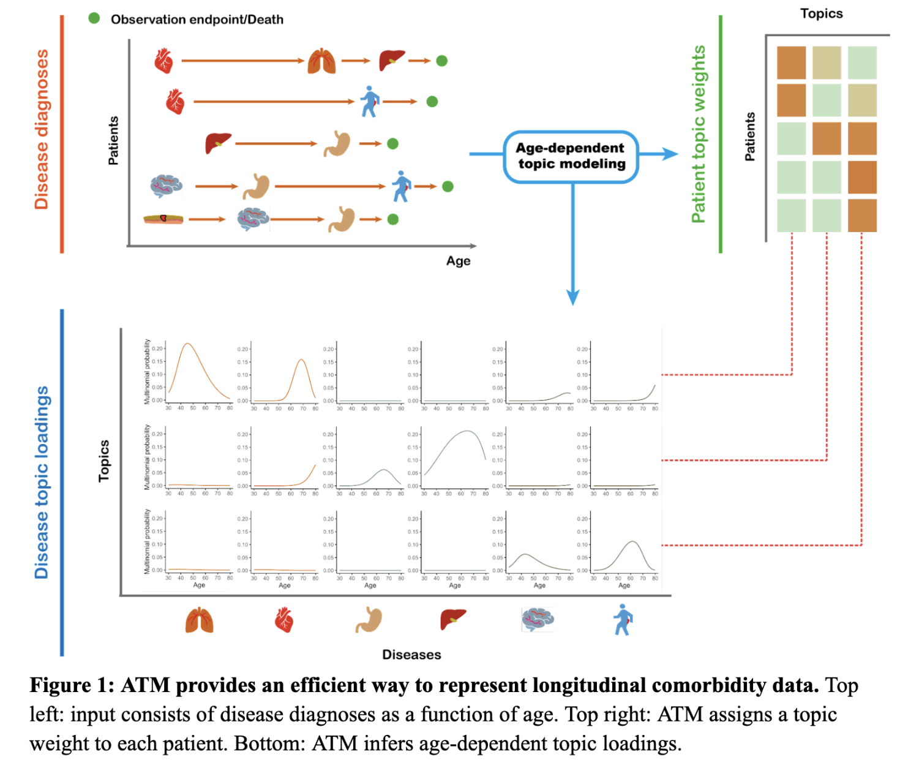
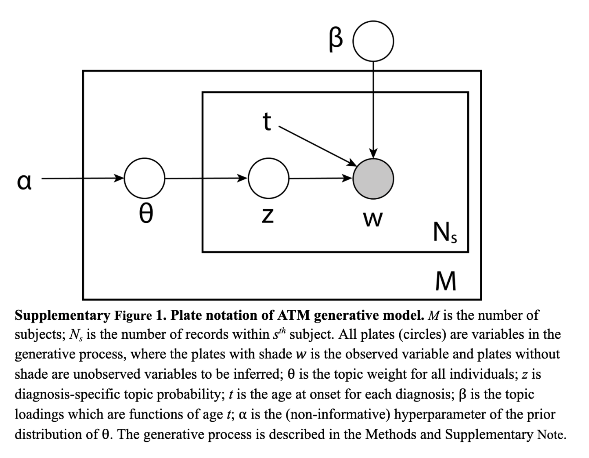

## ATM

Age-dependent topic modelling (ATM) is a method for inferring comorbidity profiles for individuals at Biobank Scale. Details of the Method is available in the paper [Age-dependent topic modelling of comorbidities in UK Biobank identifies disease subtypes with differential genetic risk](https://www.medrxiv.org/content/10.1101/2022.10.23.22281420v2).

ATM assigns to each individual topic weights for several disease topics; each disease topic reflects a set of diseases that tend to co-occur as a function of age, quantified by age-dependent *topic loadings* for each disease. The model assumes that for each disease diagnosis, a topic is sampled based on the individual’s *topic weights* (which sum to 1 across topics, for a given individual), and a disease is sampled based on the individual’s age and the age-dependent *topic loadings* (which sum to 1 across diseases, for a given topic at a given age). The model generalises the latent dirichlet allocation (LDA) model by allowing topic loadings for each topic to vary with age. 


For bug reports, please email: <xilinjiang@hsph.harvard.edu>. 

## Installation

You can install the development version of ATM from [GitHub](https://github.com/ATM) with:

```r
# install.packages("devtools")
devtools::install_github("Xilin-Jiang/ATM")
```

## Quick start

Run ATM on diagnosis data to infer topic loadings and topic weights from diagnosis data. Note one run of ATM on 100K individuals would take ~30min (defualt is 5 runs and pick the best fit). If the data set is small and the goal is to infer patient-level topic weights (i.e. assign comorbidity profiles to individuals based on the disedases), please use loading2weights. The input data should be format data as HES_age_example; first column is individual ids, second column is the disease code; third column is the age at diagnosis. 

Note for each individual, we only keep the first onset of each diseases. Therefore, if there are multiple incidences of the same disease within each individual, the rest will be ignored.

```r
# head(HES_age_example)
ATM <- wrapper_ATM(HES_age_example, 10, CVB_num = 1)
```

If the goal is obtain the  *topic weights* for a group of individuals to learn about their comorbidity profile, there is no need to infer the comorbidity. Following code maps diagnosis history (contained in the example data `HES_age_example`) to the optimal disease topics inferred from UK Biobank HES data. 

```r
new_weights <- loading2weights(HES_age_example, ds_list = UKB_349_disease, topics = UKB_HES_10topics)
```

`UKB_HES_10topics` is the internal topics of the package. You could substitute it to other disease topics, with the same data format (a tensor of shape $age \times disease number \times topic number$). The output will be the topic weights of each individual, representing the comorbidity profile.

To visualise the topic loadings, first get the names of the disease: 

```r
disease_list <- UKB_349_disease %>% 
  left_join(disease_info_phecode_icd10, by = c("diag_icd10"="phecode" )) %>% 
  pull(phenotype)
```

## Internal data example

We provide example simulated data along with the pacakage. `UKB_349_disease` is the list of 349 diseases (Phecode) that have more than 1000 incidences in the UK Biobank HES data. `HES_age_example` is an example data simulated using the comorbidity distribution in UK Biobank; for inferring disease topics using ATM, you should format the data as `HES_age_example`, which requires individual id, disease diagnosis, and age-at-diagnosis.  `UKB_HES_10topics` is the inferred optimal disease topic from UK Biobank HES data set, using the 349 diseases.

We recommend using Phecode for ATM to reduce coding redundancy in coding system such as ICD-10. To map from ICD-10 code to Phecode, use function `icd2phecode`. `icd2phecode` make use of ICD-10 to phecode mapping which are saved as internal data in ATM package: `phecode_icd10cm` maps between ICD-10-CM to Phecode; `phecode_icd10` maps between ICD-10 to Phecode; `disease_info_phecode_icd10` saves the disease names of 1755 Phecodes, use `UKB_349_disease %>% left_join(disease_info_phecode_icd10, by = c("diag_icd10"="phecode" ))`.

## Data preparation

ATM inference is based on age-at-diagnosis information of many diseases. We use the long format to encode a sparse matrix encoding where only age information for diagnosed diseases are provided (oppose to data matrix where each row is an individual and each column is a disease), which save spaces as only a small proportion of diseases are diagnosed for each individual. `HES_age_example` is the data example, where each entry contains one diagnosis entry, with individual, disease, and age information. 

The default disease encoding of many biobanks are ICD-10; ATM support any coding system but we recommend using Phecode system which groups ICD-10 codes that represent the same disease. To map data from ICD-10 codes to Phecode, use `icd2phecode` function:  

```r
phecode_data <- icd2phecode(HES_icd10_example)
```

`icd2phecode` maps ICD-10 or ICD-10-CM codes to the Phecodes; when there are multiple Phecodes for one ICD-10/ICD-10-CM, it will map to the Phecode that are collects the largest number of ICD-10 codes (this aims to reduce the number of Phecodes in the data, which is always good for comorbidity analysis). You should remove all marks such as period and only keeps number and capital letters of the ICD-10 codes for the input data. For example, "I25.1" should be changed to "I251".  

## Inferring disease topics using diagnosis data

If you have an EHR data with age-at-diagnosis information across many diseases, you could use ATM to infer topic loadings and topic weights. Inferring ATM topic loadings is computational expensive, and the inferred topic loadings usually reprents the pattern for the specific data set and should not be extended to other population, unless they were inferred from large comprehensive biobank.If the data set is small and the goal is to infer patient-level topic weights (i.e. assign comorbidity profiles to individuals based on the disedases), please use `loading2weights` in the next section. The input data should be format data as HES_age_example; first column is individual ids, second column is the disease code; third column is the age at diagnosis. 

One reason that ATM inference is computational expensive is that you need to run multiple models to choose the best number of disease topics in the dataset. ATM does not automatically choose the best number of topics as each model (of different topic numbers) should be run in parallel and you should compare the [ELBO](https://en.wikipedia.org/wiki/Evidence_lower_bound) to choose the best fit. In the following example, `topic_num` is the number of topics ( $K$ in [math details](#generative-process-of-atm) section), which in a common EHR data you should choose between 5 to 15; `CVB_num` is the number of runs, where multiple ATM inferences will be performed and the best run will be returned, you are recommend to choose larger number for this if computational power permitting (default is 10);  `ATM_results$multiple_run_ELBO_compare` in the following section provides the ELBOs  of all the runs (i.e. for `CVB_num=10` you will get 10 ELBOs), the run with highest ELBOs is kept. Use `?wrapper_ATM` to get the details of the function. 

```r
# head(HES_age_example)
ATM_results <- wrapper_ATM(rec_data=HES_age_example, topic_num = 10, CVB_num = 1)
print(ATM_results$multiple_run_ELBO_compare)
```

To choose the optimal model structure that fits the data, running `wrapper_ATM` for each model structure (number of topics and parametric form of curves) and comparing the  `multiple_run_ELBO_compare` for each model structure. The optimal model should has the highest average ELBO across runs. 

## Inferring comorbidity profiles for individuals.

In many scenarios, we are not interested in inferring a new set of topic , but we want to use the information of comorbidity at individual level. ATM provides *topic weights* which encode comorbidity profile. To be more spefic, using disease topics from [ATM paper](https://www.medrxiv.org/content/10.1101/2022.10.23.22281420v2), if the topic weights for CVD topic is high, it means the individual has elevate comorbidity related to cardiovascular diseases. `loading2weights` function provides an easy handle for this purpose, where the input `rec_data` has the same format as in [previous section](#inferring-disease-topics-using-diagnosis-data) and the default comorbidity topics are 10 topics inferred from UK Biobank common diseases `UKB_HES_10topics`.  Following code maps diagnosis history (contained in the example data `HES_age_example`) to the default disease topics inferred from UK Biobank HES data. 

```r
new_weights <- loading2weights(rec_data=HES_age_example, ds_list = UKB_349_disease, topics = UKB_HES_10topics)
```

## Visualise the comorbidity loadings.
To visualise the disease topics inferred from the data set, use the `plot_age_topics` functions. To use this function, you need th specify `disease_names`, disease topics `trajs`, title of the plot `plot_title`, and an optional age starts point to adjust the x-axis labels in case the supplied topic loadings does not start from age 0. You could also specify how many disease you want to show using `top_ds`.

`disease_names` and `trajs` could be extracted from the output variable from `ATM_wrapper`. `disease_names` is the name of diseases ordered as `ATM_results$ds_list$diag_icd10`, assuming `ATM_results` is output of `ATM_wrapper`. While you could directly use the disease code, we recommend you use meaning disease discription as it will directly shows on the output figure. Similarly, `trajs` could be obtained by subsetting one matrix from `ATM_results$topic_loading`. For example `ATM_results$topic_loading[,,3]` is the third topics of the inference result.    

If not clear about the inputs above, please test and check code below, which provides an example of disease topic visualisation. 
```r
disease_list <- UKB_349_disease %>%
  dplyr::left_join(disease_info_phecode_icd10, by = c("diag_icd10"="phecode" )) %>%
  dplyr::pull(phenotype)
topic_id <- 1 # plot the first topic
plot_age_topics(disease_names = disease_list,
        trajs = UKB_HES_10topics[30:80,,topic_id],
        plot_title = paste0("topic ", topic_id),
        top_ds = 7)
```


## Generative process of ATM



We constructed a Bayesian hierarchical model to infer latent risk profiles for common diseases.  In summary, the model assumes there exist a few disease topics that underlie many common diseases.  Each topic is age-evolving and contain risk trajectories for all diseases considered. An individual's risk for each diseases is determined by the weights of all topics. The indices in this note are as follows:
$$s= 1,...,M;$$
$$n= 1,...,N_s;$$
$$i= 1,...,K;$$
$$j= 1,...,D;$$
where $M$ is the number of subjects, $N_s$ is the number of records within $s^{th}$ subject, $K$ is number of topics, and $D$ is the total number of diseases we are interested in.
The generative process (Supplementary Figure 1) is as follows: 

- $\theta \in \mathcal{R}^{M \times K}$ is the topic weight for all individuals, each row of which ( $\theta_s \in \mathcal{R}^{K}$ ) is assumed to be sampled from a Dirichlet distribution with parameter $\alpha$. $\alpha$ is set as a hyper parameter.
  $$\theta_s \sim Dir(\alpha).$$

- $\mathbf{z} \in \{1,2,...,K\}^{\sum_s N_s}$ is the topic assignment for each diagnosis $\mathbf{w}  \in \{1,2,...,D\}^{\sum_s N_s}$. Note the total number of diagnoses across all patients are $\sum_s N_s$. The topic assignment for each diagnosis is generated from a multinoulli distribution with parameter equal to $s^{th}$ individual topic weight. 
  $$z_{sn} \sim Multi(\theta_s).$$

- $\beta(t) \in \mathcal{F}(t)^{K \times D}$ is the topic which is $K \times D$ functions of age $t$. $\mathcal{F}(t)$ is the class of functions of $t$. At each plausible $t$, the following is satisfied:
  $$\sum_j \beta_{ij}(t) = 1.$$
  In practice we use softmax function to ensure above is true and add smoothness by constrain $\mathcal{F}(t)$ to be spline or polynomial functions:
  $$\beta_{ij}(t) = \frac{\exp(p_{ij}^T \phi (t))}{\sum_{j} \exp(p_{ij}^T \phi (t))},$$
  where $p_{ij} = ( p_{ij,d} ), \; d = 1,2,...,P$ is the vector of parameter for the topic loading functions; $P$ is the degree of freedom than controls the smoothness; $\phi (t)$ is polynomial and spline basis for age $t$.

- $w \in \{1,2,...,D\}^{\sum_s N_s}$ are observed diagnoses. The $n^{th}$ diagnosis of $s^{th}$ individual $w_{sn}$ is sampled from the topic $\beta_{z_{sn}}(t)$ chosen by $z_{sn}$:
  $$w_{sn} \sim Multi(\beta_{z_{sn}}(t_{sn})),$$
  here $t_{sn}$ is the age of the observed age-at-onset of the observed diagnosis $w_{sn}$.
